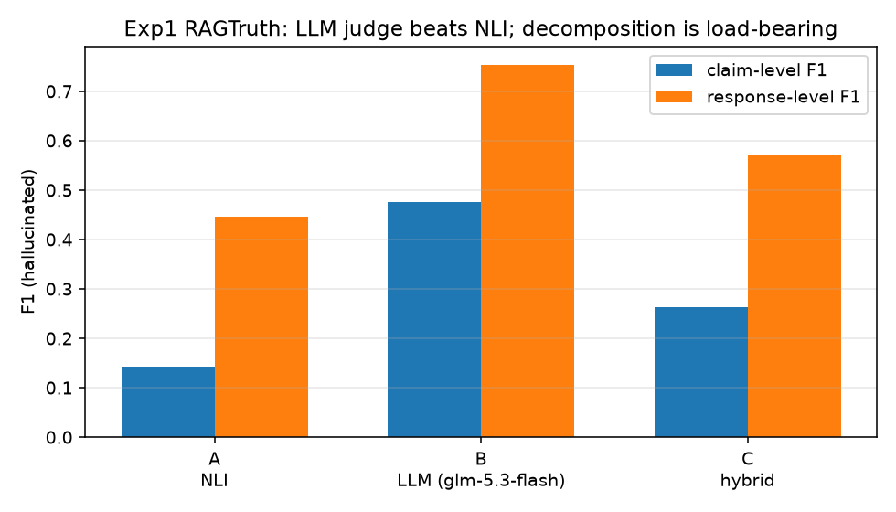
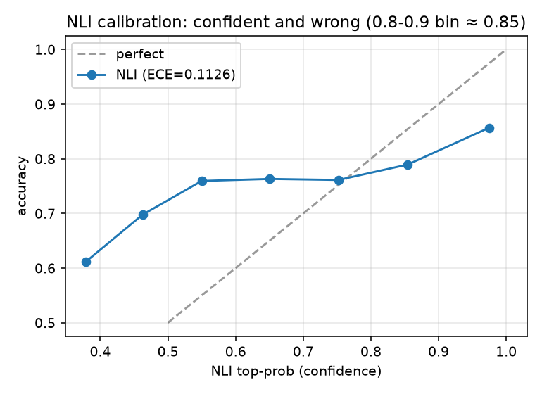
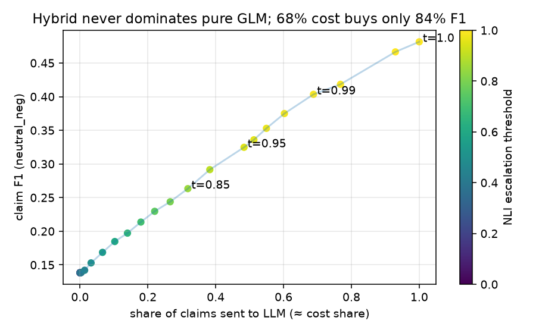
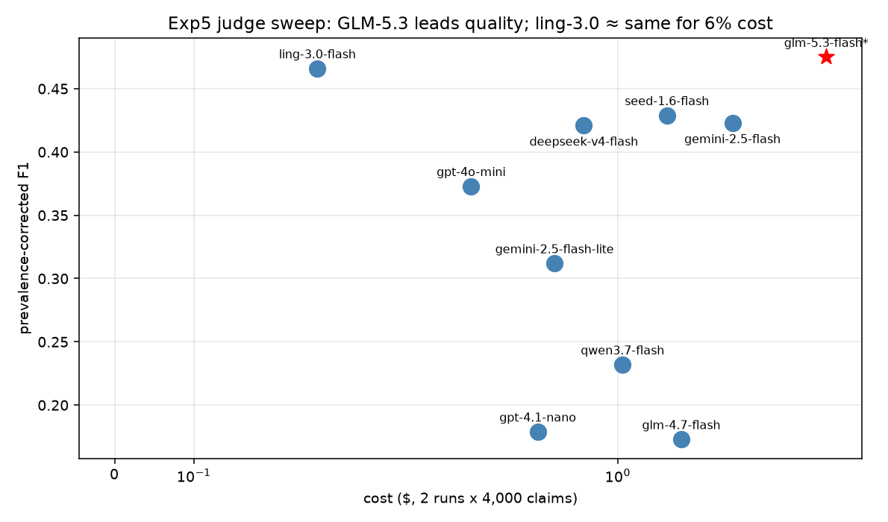
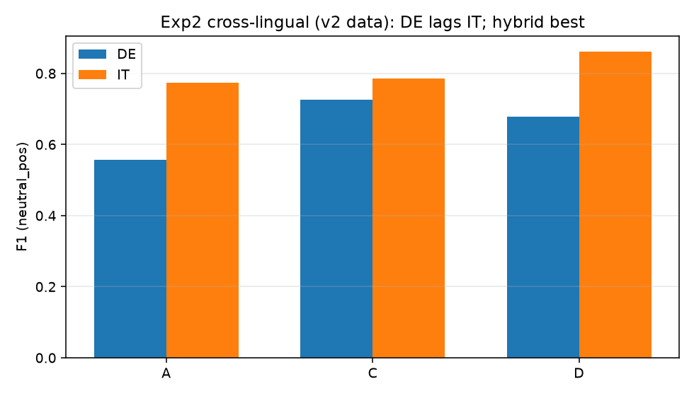
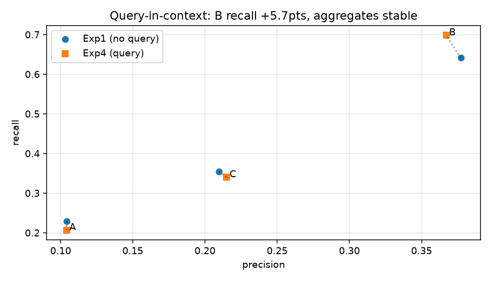
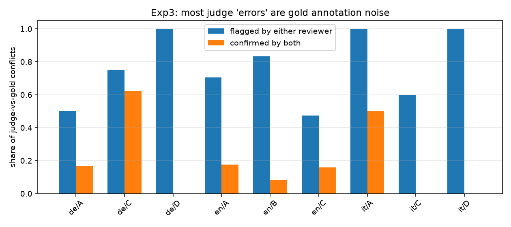

# ragfaith

*How much does it cost to know whether an AI actually read the documents it
claims to have read?*

That is the question this project chased for a few weeks in the summer of
2026. Retrieval-augmented generation is now how most serious AI products
answer questions: fetch some passages, write a reply grounded in them. But
"grounded" is doing a lot of work in that sentence. Models wander. They
paraphrase until the meaning slips, they quietly import facts the documents
never said, and — less often, but more alarmingly — they invent things
outright. If you ship one of these systems, you want a machine that watches
for that. A faithfulness judge.

So we built the arena to find the best one: 18,900 claims from real RAG
systems (RAGTruth, English), plus 800 carefully constructed German and
Italian test cases, plus a separate set of 600 real-world answers where the
hallucinations weren't planted by us but happened naturally. Then we ran
everything we could buy against it: a classic NLI model, nine cheap LLM
judges, hybrids of the two, translation pipelines, a distilled student
model, and — because people kept asking "but what about the frontier
models?" — two flagship-class models across the same benchmark. Two humans
cross-checked the disagreements by hand, twice.

The short version: **an unglamorous little model,
[glm-5.3-flash](https://openrouter.ai/z-ai/glm-5.3-flash), beat everything —
including models costing 22× more per token — and its even smaller cousin,
ling-3.0-flash, costs a quarter of that while keeping about 97% of the
quality.** Nothing genuinely beats paying attention to what the cheap,
purpose-asked judges can do.

## What the arena looks like

Every judge gets the same job, one claim at a time: here is the question,
here are the passages the system used, here is one atomic claim from the
answer — is it *faithful*, *unfaithful*, or *unverifiable*? We decompose
answers into claims (splitting turns out to be load-bearing; a judge that
skips decomposition drops to a response-level F1 of 0.107), wrap the
evidence in a labeled `QUESTION: … PASSAGES: …` premise (worth +5.7 points
of recall for the LLM judges), and score against hand-labeled truth.

Four archetypes went in:

- **A — the NLI judge.** A 279M-parameter DeBERTa that classifies each
  (passage, claim) pair as entailment, neutral, or contradiction. Free,
  local, milliseconds per claim.
- **B — the LLM judge.** Ask a language model directly, strict JSON
  verdicts only.
- **C — the hybrid.** Trust the NLI when it's confident, escalate the rest
  to the LLM. The sensible-sounding middle path.
- **D — no decomposition.** Judge whole answers in one shot. The control.

## What we found

**The NLI judge is not a detector — it's a false sense of security.** Its
recall is 0.23: it waves three hallucinations past for every one it catches.
Worse, it's miscalibrated in the exact regime you'd want to trust (ECE
0.113 — the 0.8–0.9 confidence bins give you ~85% accuracy, not 90%). It's
fine as a rough high-precision filter; as a gatekeeper it fails silently.

**The hybrid — the design everyone would sketch on a whiteboard — is a
trap.** We swept its escalation threshold across the full cache at zero
cost (`rfe threshold-sweep`) and the curve is honest: to keep 97% of the
LLM's quality you must send 93% of claims to the LLM anyway. At the default
0.85 threshold we'd shipped earlier, it loses *half* the LLM's F1. Trusting
NLI confidence is trusting it exactly where it is most wrong. The sensible-
sounding middle path is just a discount coupon for lower quality.





**The cheap, focused LLM judge wins.** glm-5.3-flash lands claim-level F1
0.475 (response-level 0.75) against the NLI's 0.143 — and it stays stable
across reruns (91% verdict agreement run-to-run). Among the nine models we
swept, nothing specialized-beats-it at any price point; a few lose
embarrassingly (two well-known flash models landed below 0.25 F1 and are,
frankly, not usable as judges).



**The frontier didn't save anyone's honor either.** Out of genuine
curiosity we spent $4.27 pitting claude-sonnet-5 and deepseek-v4-pro
against the same 1,000 claims. The frontier flagship scored *8 points
below* the flash model at 22× the billed cost. Part of the explanation is
mundane and useful: half of judging at scale is answering in strict,
parseable JSON every single time — one contender failed to do that 13% of
the time and paid a 42% retry tax for it. Compliance is a capability.

**Cross-lingual is its own trap, and translation is the ladder out.** Ask a
multilingual NLI to judge a German claim against a German passage and its
hallucination recall is 0.39. Translate the evidence to English first and
recall nearly doubles to 0.73. Italian is kinder to everyone (near-tie
either way). German was also where we learned to respect our own pipeline:
an early bug made entity swaps target "the first capitalized word" — which,
in German, is every noun — and inflated our scores by a fifth before we
caught it. Version 2 of the German data is the only one worth quoting.




**The most uncomfortable finding: a chunk of "truth" was wrong.** When
judges disagreed with the gold labels, we sampled the fights and had two
humans adjudicate 71 of them case by case. After adjudication, **42% of the
apparent judge errors were actually gold annotation noise.** Every judge
looks better than its raw score — the ranking stays identical, but the
absolute numbers soften. The single most common *judge* mistake is the
opposite of what you'd fear: over-flagging faithful claims (`precision
discipline`, not recall). And in a gentle irony, the same exercise found
that organic, naturally-occurring hallucinations (600 real German/Italian
answers) are only rarely fabrications — under 1% — while *unverifiable
drift*, answers quietly wandering off the page, runs 8–10%. The enemy
isn't lying; it's straying.



**What we failed at (and what that failure taught).** We tried to distill
the NLI teacher into a 2.4× smaller, 6.4× faster student, twice. The first
run's Italian F1 collapsed (0.31 vs teacher 0.66); the retry fixed *that*
(an Italian-heavy training mix was the real bug, not capacity — student
came back to 0.54) but the student's real job had been reframed as a
high-recall pre-filter, and catching 95% of hallucinations requires it to
escalate 78% of claims anyway. Thin soup. The student stays on its own
branch as a measured negative result — arguably the most useful kind.

## The numbers, for the record

Headline table (English, Exp4 protocol — the standing one):

| Judge | Claim F1 | Noise-adjusted F1 | Cost, full 18.9k claims |
|---|---|---|---|
| glm-5.3-flash | **0.481** | **0.693** | ~$1.92 |
| ling-3.0-flash | 0.457 · response F1 0.742 (98% of GLM) | — | $0.45 |
| NLI (mDeBERTa-xnli-2mil7) | 0.138 | 0.369 | free, local |
| Distilled MiniLM student | not promotable (2× negative result) | — | free, local |

Per-arm detail (Exp1, claim-level, `neutral_neg`):

| Arm | Judge | Precision | Recall | F1 | Response F1 |
|---|---|---|---|---|---|
| A | multilingual NLI | 0.104 | 0.229 | 0.143 | 0.446 |
| B | LLM (glm-5.3-flash) | 0.377 | 0.641 | **0.475** | **0.753** |
| C | hybrid @0.85 | 0.210 | 0.354 | 0.263 | 0.572 |
| D | no decomposition | — | — | — | 0.107 |

Cross-lingual (Exp2, claim-level, `neutral_pos`):

| Arm | Judge | DE F1 | IT F1 |
|---|---|---|---|
| A | multilingual NLI direct | 0.556 | 0.774 |
| C | translate → English judge | **0.726** | **0.786** |
| D | hybrid NLI + LLM arbitration | 0.678 | **0.862** |

Frontier check (same 1k claims each, single pass):

| Model | Claim F1 | F1 (natural rate) | Recall | Cost per 1k |
|---|---|---|---|---|
| glm-5.3-flash | 0.739 | **0.485** | 0.692 | ~$0.12 |
| ling-3.0-flash | 0.658 | 0.444 | 0.565 | ~$0.04 |
| claude-sonnet-5 | 0.702 | 0.403 | 0.686 | $2.64 |
| deepseek-v4-pro | 0.677 | 0.417 | 0.619 | $1.63 |

Noise-adjusted finals (adjudicated labels, `rfe noise-adjust`):

| Arm | Reported | Corrected |
|---|---|---|
| exp4 B (GLM) | 0.475 | **0.693** |
| exp4 A (NLI) | 0.138 | 0.369 |
| exp2 C · DE | 0.726 | 0.931 |
| exp2 C · IT | 0.786 | 0.831 |

## How to read this honestly

- The headline numbers depend on prevalence and mapping choices; both
  conventions are always computed and reported.
- The noise correction comes from small annotated cells (n=1…19 per
  language-arm pair) — treat single-cell F1 1.0s as directional.
- The DE/IT synthetic set measures exactly what it's asked (planted
  hallucinations); the organic set measures a different beast, and its
  current labels are self-judged (human pass descoped).
- Costs are real OpenRouter bills as of September 2026 (~$19.4 total across
  everything you see here, including all the reruns and mistakes). The
  "~7% cheaper" ratio sometimes quoted for ling is a list-price ratio;
  billed reality on this workload was 23% of GLM — still the best value we
  measured, just honestly reported.

## Running it yourself

Every single number above is reproducible from the checked-in caches for
$0 — `rfe repro` re-derives the core metrics and asserts zero drift,
`rfe threshold-sweep` and `rfe noise-adjust` replay the two $0 analyses,
`rfe exp5` re-runs the full sweep from cache. The one-command journey from
empty checkout to every figure is in **[docs/reproduce.md](docs/reproduce.md)**.

The points worth stealing for your own project:

1. Decompose answers into claims first; judge atoms, not paragraphs.
2. Put the question in the premise, labeled. It's nearly free and it's real.
3. Don't trust a locally-confident cheap model to decide when *not* to call
   the expensive one unless its calibration is genuinely good — it usually
   isn't.
4. Budget for the possibility that a third-plus of your "judge errors" are
   annotation noise, and adjudicate before concluding.
5. Cross-lingual: translate to English, then judge in English. On German
   it's not close.

## Development

```sh
pip install -e '.[dev,models]'
pytest            # 35 unit tests
ruff check .
```

API judge calls need `OPENROUTER_API_KEY` in `.env` (never committed; every
run prints live billed cost and resumes free). Human annotation tooling
(`rfe exp3-annotate`, `rfe exp3-adjudicate`) is resumable and documented in
[docs/annotation_instructions.md](docs/annotation_instructions.md). Project
state, pitfalls, and what we're building next live in
[HANDOFF.md](HANDOFF.md).

## Data sources + licenses

| Lang | Source | License |
|------|--------|---------|
| EN | RAGTruth processed (wandb) | research use |
| DE/IT synthetic | SNLI / XNLI / 2mil7 `it_mnli` | CC BY-SA 4.0 / OANC / CC BY-NC 4.0 |
| DE organic | google/xquad `xquad.de` | CC BY-SA 4.0 |
| IT organic | crux82/squad-it test | CC BY-SA 4.0 |

IT caveat: XNLI has no Italian, and `it_mnli` is machine-translated MNLI —
the same family the NLI judge trained on, so IT synthetic results carry a
contamination caveat.
